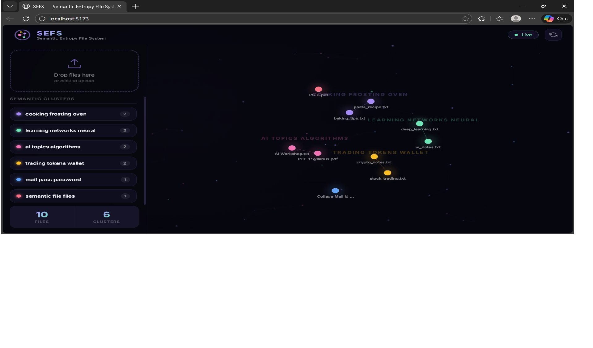
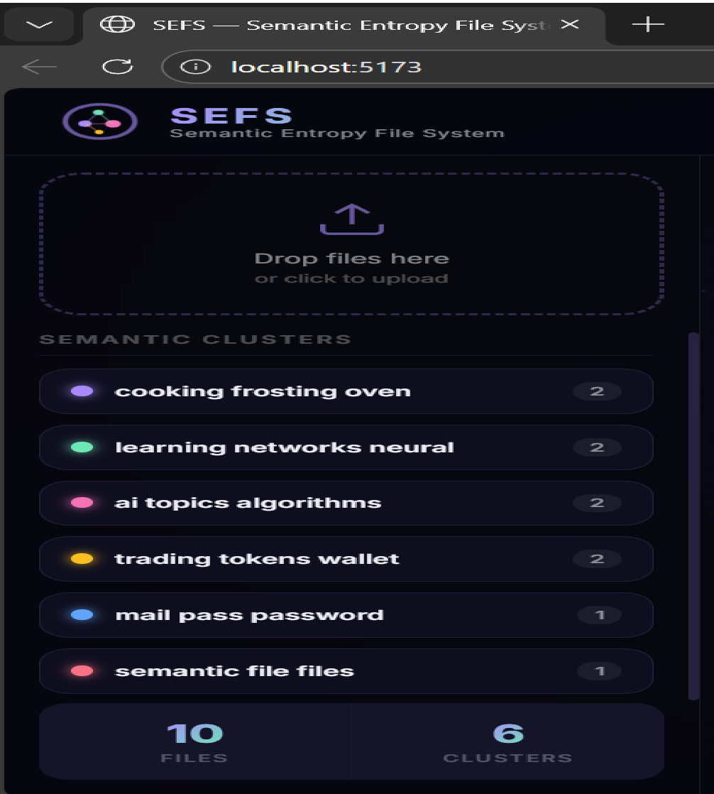
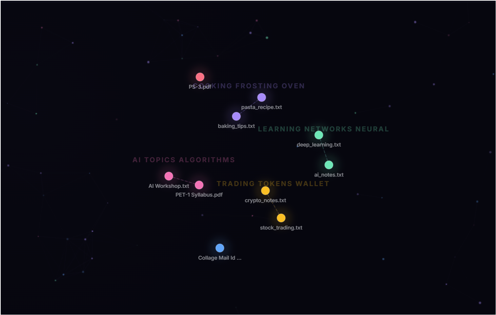
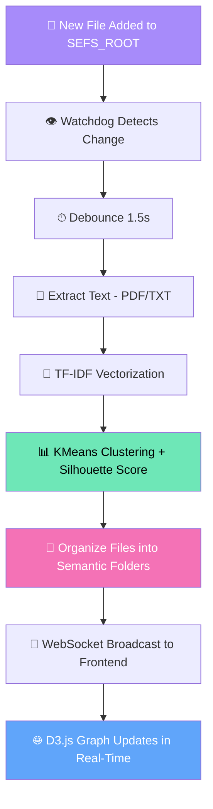

<](https://python.org)
[](https://fastapi.tiangolo.com)
[](https://developer.mozilla.org/en-US/docs/Web/JavaScript)
[](https://d3js.org)
[](https://vitejs.dev)

---

**SEFS replaces rigid, manual folder hierarchies with a dynamic semantic layer that automatically organizes your files based on their content and meaning — in real-time.**

[Features](#-features) · [Demo](#-demo) · [Tech Stack](#-tech-stack) · [Quick Start](#-quick-start) · [Architecture](#-architecture) · [How It Works](#-how-it-works)

</div>

---

## 📌 Problem Statement

Traditional file management relies on **rigid, manual hierarchies** of folders and sub-folders that quickly become disorganized and inefficient. Users must manually categorize every file, leading to:

- 🗂️ Deeply nested folder structures that are hard to navigate
- 🔍 Difficulty finding related documents across different folders
- ⏰ Wasted time manually organizing and reorganizing files
- 📊 No insight into how files relate to each other semantically

## 💡 Solution

SEFS (Semantic Entropy File System) is a **self-organizing file manager** that:

1. **Monitors** a root directory for new/modified PDF and TXT files
2. **Analyzes** file content using NLP (TF-IDF vectorization)
3. **Clusters** semantically related files using KMeans + Silhouette scoring
4. **Organizes** files into meaningful OS-level folders automatically
5. **Visualizes** relationships in a real-time interactive 2D force-directed graph

---

## ✨ Features

| Feature | Description |
|---------|-------------|
| 🔄 **Auto-Detection & Processing** | Monitors a root directory and automatically processes any new or modified PDF/TXT file |
| 📁 **Semantic Folder Organisation** | Dynamically creates and maintains folders based on content similarity |
| 🔗 **OS-Level Synchronisation** | Bidirectional — semantic reorganization updates OS folders, and manual file actions trigger re-analysis |
| 🌐 **Interactive 2D Graph** | Force-directed graph with draggable nodes, hover tooltips, and live cluster visualization |
| 📤 **Drag & Drop Upload** | Upload files directly through the web interface |
| ⚡ **Real-Time Updates** | WebSocket-powered live updates — see changes as they happen |
| 🎨 **Premium Dark UI** | Glassmorphism, particle effects, smooth animations, and gradient accents |
| 📊 **Smart Clustering** | Auto-tuned KMeans with silhouette score optimization for optimal groupings |

---

## 🎬 Demo

### 📸 Screenshots

> **To add your own screenshots:**
> 1. Run the application (see [Quick Start](#-quick-start))
> 2. Open `http://localhost:5173` in your browser
> 3. Take screenshots using `Win + Shift + S` or any screenshot tool
> 4. Save them to the `docs/` folder
> 5. Update the paths below

<!-- Replace these with your actual screenshots -->

#### Main Dashboard

*Force-directed graph showing semantic clusters with interactive nodes*

#### Sidebar with Clusters

*Expandable cluster cards showing semantically grouped files*

#### File Tooltip

*Hover over any node to see file metadata — name, cluster, size, and type*

---

### 🎥 Demo Video

> **To record a demo video:**
> 1. Use [OBS Studio](https://obsproject.com/) or Windows Game Bar (`Win + G`) to record your screen
> 2. Show: uploading a file → watching it get auto-clustered → graph updating in real-time
> 3. Save as `docs/demo.mp4` or upload to YouTube
> 4. Update the link below

<!-- Replace with your actual demo video link -->
🔗 **[Watch Demo Video](docs/demo.mp4)** <!-- or use a YouTube link -->

---

## 🛠 Tech Stack

### Backend
| Technology | Purpose |
|-----------|---------|
| **Python 3.10+** | Core runtime |
| **FastAPI** | REST API & WebSocket server |
| **Uvicorn** | ASGI server |
| **scikit-learn** | TF-IDF vectorization & KMeans clustering |
| **PyPDF2** | PDF text extraction |
| **watchdog** | Real-time filesystem monitoring |
| **NumPy** | Numerical computations |

### Frontend
| Technology | Purpose |
|-----------|---------|
| **Vite** | Build tool & dev server with HMR |
| **D3.js v7** | Force-directed graph visualization |
| **Vanilla JavaScript** | Application logic (no framework overhead) |
| **CSS3** | Glassmorphism, animations, responsive layout |
| **Google Fonts (Inter)** | Modern typography |

### Communication
| Technology | Purpose |
|-----------|---------|
| **WebSocket** | Real-time bidirectional updates |
| **REST API** | State queries, file upload, file retrieval |

---

## 🚀 Quick Start

### Prerequisites

- **Python 3.10+** — [Download](https://www.python.org/downloads/)
- **Node.js 18+** — [Download](https://nodejs.org/)
- **pip** — Comes with Python
- **npm** — Comes with Node.js

### Installation

**1. Clone the repository**
```bash
git clone https://github.com/gaurishmattoo/SEFS.git
cd SEFS
```

**2. Install backend dependencies**
```bash
cd backend
pip install -r requirements.txt
```

**3. Install frontend dependencies**
```bash
cd ../frontend
npm install
```

### Running the Application

You need **two terminals** running simultaneously:

**Terminal 1 — Start Backend (Port 8000)**
```bash
cd backend
python main.py
```

**Terminal 2 — Start Frontend (Port 5173)**
```bash
cd frontend
npm run dev
```

**4. Open your browser**
```
http://localhost:5173
```

> 💡 **Tip:** Add PDF or TXT files to the `SEFS_ROOT/` folder and watch them auto-organize!

---

## 📦 Dependencies

### Backend (`backend/requirements.txt`)
```
fastapi          # Web framework for REST + WebSocket
uvicorn          # ASGI server
watchdog         # Filesystem event monitoring
scikit-learn     # ML: TF-IDF + KMeans clustering
PyPDF2           # PDF text extraction
python-multipart # File upload handling
websockets       # WebSocket protocol support
numpy            # Numerical computing
```

### Frontend (`frontend/package.json`)
```
d3       ^7.9.0   # Data visualization library
vite     ^5.4.0   # Build tool (dev dependency)
```

---

## 🏗 Architecture

```
SEFS/
├── backend/                    # Python FastAPI server
│   ├── main.py                 # Entry point — starts Uvicorn server
│   ├── server.py               # FastAPI app, REST endpoints, WebSocket
│   ├── analyzer.py             # Text extraction (PDF/TXT) + TF-IDF + KMeans
│   ├── organizer.py            # OS-level file organization (move/create folders)
│   ├── watcher.py              # Filesystem monitoring with debouncing
│   └── requirements.txt        # Python dependencies
│
├── frontend/                   # Vite + Vanilla JS frontend
│   ├── index.html              # Main HTML — header, sidebar, graph viewport
│   ├── style.css               # Premium dark theme with glassmorphism
│   ├── main.js                 # Entry point — WebSocket, state management
│   ├── graph.js                # D3.js force-directed graph + convex hulls
│   ├── sidebar.js              # Cluster cards, upload zone, stats
│   ├── particles.js            # Canvas particle animation background
│   ├── vite.config.js          # Vite config with API proxy
│   └── package.json            # Node dependencies
│
├── SEFS_ROOT/                  # 📂 Monitored root directory
│   ├── cooking_frosting_oven/  # Auto-created semantic folder
│   ├── learning_networks_neural/
│   ├── ai_topics_algorithms/
│   ├── trading_tokens_wallet/
│   └── ...                     # More folders created dynamically
│
├── docs/                       # Screenshots & demo assets
├── .gitignore
└── README.md
```

---

## 🔬 How It Works



### Pipeline Details

1. **File Monitoring** — `watchdog` observes `SEFS_ROOT/` for create, modify, rename, and delete events
2. **Debouncing** — Rapid events are batched with a 1.5-second debounce timer
3. **Text Extraction** — `PyPDF2` extracts text from PDFs; plain read for TXT files
4. **Vectorization** — `TfidfVectorizer` converts text to 5000-feature vectors (English stop words removed)
5. **Clustering** — `KMeans` with silhouette score auto-tuning finds optimal k (2–8 clusters)
6. **Labelling** — Cluster names are generated from top 3 TF-IDF terms per centroid
7. **Organization** — Files are physically moved into named subdirectories of `SEFS_ROOT/`
8. **Broadcasting** — Updated state is pushed via WebSocket to all connected frontends
9. **Visualization** — D3.js renders a force-directed graph with convex hull cluster boundaries

---

## ⚠️ Important Instructions

1. **Supported File Types:** Currently supports `.pdf` and `.txt` files only
2. **Root Directory:** All files must be placed in `SEFS_ROOT/` — the system only monitors this directory
3. **No Manual Folder Editing:** Don't manually rename the auto-created semantic folders (the system manages them)
4. **Two Terminals Required:** Backend and frontend run as separate processes
5. **File Safety:** The organizer uses file locking to prevent watcher loops during reorganization
6. **Minimum Files:** You need at least 2 files with extractable text for clustering to work
7. **Internet Required:** Frontend loads Google Fonts (Inter) from CDN on first load

---

## 🤝 Contributing

1. Fork the repository
2. Create a feature branch (`git checkout -b feature/amazing-feature`)
3. Commit your changes (`git commit -m 'Add amazing feature'`)
4. Push to the branch (`git push origin feature/amazing-feature`)
5. Open a Pull Request

---

## 📄 License

This project is open source and available under the [MIT License](LICENSE).

---

<div align="center">

**Built with ❤️ using Python, FastAPI, D3.js, and Machine Learning**

*SEFS — Because your files should organize themselves.*

</div>
]]>
